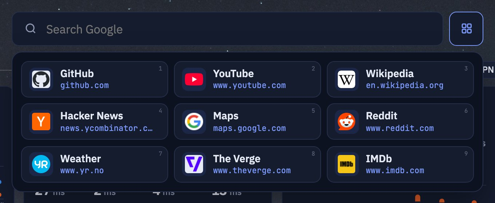
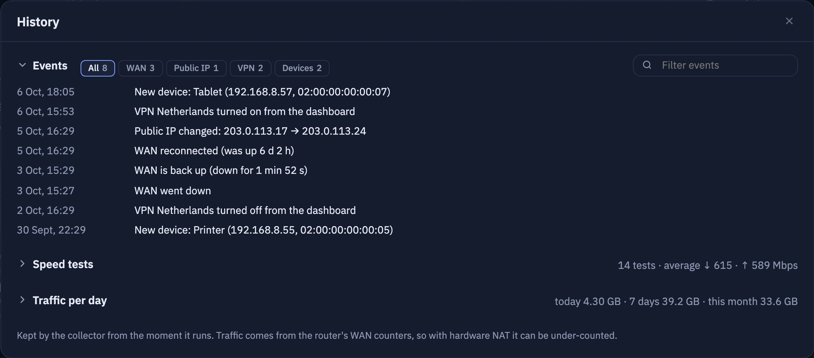

# glinet-dashboard

A self-hosted start page with live stats from a **GL.iNet** router: WAN traffic, the router's
**Network Quality** score, **AdGuard Home** DNS stats and a one-click / nightly **speed test**, next
to tiles for your homelab services. One small container, one port, configured with a single YAML file.


<details>
<summary>Light theme, quick links, history</summary>





</details>

## Features

- **Internet:**
  - live download/upload rate with a 30-second chart;
  - public IP and protocol, bytes received/sent and WAN uptime;
  - a ↻ button next to the IP re-dials the WAN to get a new IP (after a confirmation);
  - "Now:" shows the three devices downloading the most right now.
- **Network quality:** the same data as the GL.iNet *Network Quality* page:
  - score and level;
  - internet, gateway and DNS latency, jitter;
  - 30-minute status and packet-loss history.
- **Speed test:**
  - run the router's built-in speed test from the page, with live progress;
  - schedule it every night (for example at 03:00 router time);
  - the page shows when the last test ran.
- **DNS (AdGuard Home on the router):**
  - queries, blocked share and average processing time;
  - allowed/blocked per hour for the last 24 h;
  - top queried and top blocked domains;
  - a *Pause 30 min* button next to the protection status pauses AdGuard filtering like AdGuard's own menu (it resumes by itself; *Resume* turns it back on early).
- **Alerts:** orange warnings and red critical alerts appear in the middle of the *Network* line: router CPU temperature, memory and load, a router restart, the dashboard losing the router, the WAN going down, a WAN reconnect or public IP change, a speed test below your plan, slow DNS or a slow DNS upstream. The most severe one is shown with a "+N" badge; hover it for the full list. Thresholds are set under `alerts:` in the config.
- **Router at a glance:** hover *Live* for CPU temperature, load, memory, uptime and the last update; the *Devices* button shows the number of connected clients; hover the DNS card title for the upstream servers and their response times.
- **Services:**
  - grouped tiles with icons that open in the same tab, like a browser start page;
  - instant filter: `/` to focus, Enter opens the first match, Cmd/Ctrl+Enter opens it in a new tab;
  - the LAN address shows in the tooltip;
  - a status dot on every tile with a `host:port` address (TCP check every minute), the tooltip says since when a service is down, and the heading counts services that are down.
- **Quick links:** the grid button next to the search box opens a panel of bookmark tiles (icon, name, address).
  - The page title and favicon of each link are fetched by the collector and cached; type a name to override the title.
  - Keys **1-9** open the first nine links, with no field focused; any letter starts a Google search, `/` jumps to the service filter.
  - Edited in *Settings*: drag to reorder, the number is the hotkey.
- **Settings** (gear in the bottom-right corner): quick links and the wallpaper, saved by the collector in `/app/data`; the config file stays read-only.
- **Start page extras:**
  - Google search box, clock and a tab icon;
  - hover the clock for the time in other cities (`page.world_clock`);
  - hints wait a moment before appearing (`page.hint_delay`), so they do not pop up while the mouse passes by;
  - quote of the day in the bottom-left corner, downloaded daily and cached for offline use; the author's name links to Wikipedia;
  - background image with the photographer and location in the bottom-right corner (the location opens Google Maps): set it in the config, paste an Unsplash photo link in *Settings*, or let it rotate through an Unsplash collection with ‹ › and "don't show again" buttons (see [Wallpaper from the page](#wallpaper-from-the-page));
  - light/dark/auto theme with a switch.
- **VPN** (button next to the *Network* heading, showing *VPN off* or the active tunnel): the router's VPN client tunnels with their state (off / connecting / connected) and a *Turn on* / *Turn off* switch each, the same as on the GL VPN Dashboard; turning one on asks for confirmation. A connected tunnel shows its external IP and location, looked up by the collector through the tunnel (ifconfig.co, ipinfo.io as backup); if the dashboard's own host does not use the tunnel, it says so instead of showing a wrong IP.
- **Devices** (button next to the *Network* heading, with the client count): every device from the router's client list with its IP, 2.4G/5G/cable, current download/upload, traffic and connected time; sortable, filter by name, IP or MAC, offline devices collapsed. A device never seen before is marked *new* for 24 hours and logged in the history.
- **History** (button next to the *Network* heading), kept in `/app/data/history.json`; one section open at a time:
  - events: WAN drops and reconnects, public IP changes, VPN switches and new devices, with a filter by type and text;
  - every speed test over time;
  - traffic received/sent per day for the last 30 days, with today, 7-day and monthly totals.
- **Fits one screen** and scales up to fill large displays.
- **Live configuration:** edits to `services.yaml` show up within 30 seconds, without a restart or rebuild. Mistakes are reported on the page while the last valid version keeps working.

## Requirements

- A GL.iNet router with **firmware 4.x**. Developed on a GL-MT6000 (Flint 2); other 4.x models with the same features should work.
- Router features used, each optional; a card shows "stale" when its source is missing:

  | Feature | Needed for |
  |---|---|
  | **Network Quality** enabled | quality card, live rate, speed test |
  | **AdGuard Home** enabled on the router | DNS card |
  | **LuCI** reachable at `http://<router>:8080` (installed by default on GL.iNet 4.x) | WAN byte counters and uptime |

- The router `root` password.
- Docker on a machine in the same LAN (amd64 or arm64).

## Quick start

```sh
git clone https://github.com/sSpeaker/glinet-dashboard.git
cd glinet-dashboard
cp -r config.example config            # your own copy; it is git-ignored
# edit config/services.yaml: network.router, your services, title ...

export GL_PASS='your-router-root-password'   # or: echo "GL_PASS=..." > .env && chmod 600 .env
docker compose up -d
```

Open `http://<docker-host>:3100`.

**Without git:** download `docker-compose.yml` and pull the example config out of the image:

```sh
curl -O https://raw.githubusercontent.com/sSpeaker/glinet-dashboard/main/docker-compose.yml
docker run --rm --entrypoint tar sspeaker/glinet-dashboard -C /app -c config | tar x
```

**Plain `docker run`:**

```sh
docker run -d --name glinet-dashboard --restart unless-stopped -p 3100:3100 \
  -e GL_PASS='your-router-root-password' \
  -v "$PWD/config:/app/config:ro" -v glinet-dashboard-data:/app/data \
  sspeaker/glinet-dashboard:latest
```

The password is only ever read from the `GL_PASS` environment variable. Never put it in the YAML or the compose file.

### CasaOS

[`casaos/docker-compose.yml`](casaos/docker-compose.yml) installs the dashboard as a regular CasaOS app, with its own
tile, icon, running status, and start/stop/logs/settings in the CasaOS UI.

1. **Put a config into the app folder**, `/DATA/AppData/glinet-dashboard/config/` (the `services.yaml` plus `icons/` and the background). Use the CasaOS *Files* app, `scp`, or start from the example:

   ```sh
   sudo mkdir -p /DATA/AppData/glinet-dashboard
   sudo docker run --rm --entrypoint tar sspeaker/glinet-dashboard -C /app -c config \
     | sudo tar x -C /DATA/AppData/glinet-dashboard
   ```

2. **Import the app:** in CasaOS click **+** → **Install a customized app** → **Import** (top right). Paste the contents of [`casaos/docker-compose.yml`](casaos/docker-compose.yml) → **Submit**.
3. **Set the password:** fill in **GL_PASS** (router root password) → **Install**.

The tile opens `http://<casaos-host>:3100`. Edit `/DATA/AppData/glinet-dashboard/config/services.yaml` in place; changes
show up without a restart. The cache lives in `/DATA/AppData/glinet-dashboard/data`.

This variant runs as root inside the container, because CasaOS creates the AppData folders as root. It keeps the rest of the
hardening (read-only filesystem, all capabilities dropped), so it can only write to the data folder it owns.

## Configuration

Everything lives in `config/services.yaml`; images sit next to it. The example file is commented.

```yaml
page:
  tab_title: Home Lab            # browser tab
  title:                         # header; plain text or parts with colours
    - text: "home"
    - text: ".lab"
      color: accent              # accent (theme colour), "#e5534b", tomato, ...
  theme: auto                    # auto | light | dark (the on-page switch overrides it per browser)
  hint_delay: 600                # ms the mouse rests on an element before its hint appears; 0 = at once
  world_clock:                   # optional: hover the clock for other cities (up to 6)
    - name: Kyiv
      timezone: Europe/Kyiv      # IANA time zone
  favicon: favicon.png           # optional tab icon: file in config/ or an https:// URL
  background:                    # optional
    image: background.jpg        # file in config/ or an https:// URL
    shade: 0.45                  # 0-0.9, veil in the theme colour
    blur: 0                      # 0-40 px
    fit: cover                   # cover (crop) | contain (bars) | fill (stretch to the window)
    tone: auto                   # auto | dark | light: brightness of the image, for readable text
    credit: Jane Doe             # optional photo credit, links to credit_url (bottom-right corner)
    credit_url: https://unsplash.com/photos/...
    location: Vestrahorn, Iceland  # optional, shown after the author

network:
  subnet: 192.168.8.0/24         # shown under the title
  label: LAN
  router: 192.168.8.1            # the router the collector talks to (restart after changing)

speedtest:
  schedule: "03:00"              # daily automatic speed test, router local time; "" = off

alerts:                          # optional; these are the defaults, "off" disables a level
  cpu_temp: {warning: 80, critical: 90}         # router CPU, °C
  memory: {warning: 85, critical: 95}           # router memory used, %
  load: {warning: 3.0, critical: 4.0}           # 5-minute load average
  dns_avg_ms: {warning: 100, critical: off}     # AdGuard average processing time
  dns_upstream_ms: {warning: 150, critical: off}
  router_unreachable: true                      # critical while the router gives no data
  wan_down: true                                # critical while the WAN is offline
  router_restart_minutes: 15                    # "Router restarted" shown this long; 0 = off
  wan_event_minutes: 15                         # WAN reconnect / IP change shown this long; 0 = off
  speedtest: {download: 1000, upload: 1000, warning: 50, critical: 25}  # plan in Mbps, alert below these %

groups:
  - name: Media
    services:
      - name: Plex
        url: https://plex.example.com      # opens in the same tab
        host: plex.example.com             # second line of the tile
        addr: 192.168.8.20:32400           # tooltip + searchable
        icon: plex.svg                     # file in config/icons/ or an https:// URL
        icon_dark: plex-light.svg          # optional variant for the dark theme
        mark: PL                           # letters shown when there is no icon
        # check: false                     # status dot: default checks addr; false | url | host:port
```

**Icons:** the example ships icons from [dashboard-icons](https://github.com/homarr-labs/dashboard-icons). Find more at
`https://cdn.jsdelivr.net/gh/homarr-labs/dashboard-icons/svg/<name>.svg` and save them into `config/icons/`.

### Quick links

Open **Settings** (gear in the bottom-right corner) and add links; the address alone is enough (`github.com` becomes
`https://github.com`). The collector opens each page once to read its title (`og:site_name` or `<title>`, shortened when
long) and favicon, caches the icon in `/app/data/favicons` and retries a page it could not read after 6 hours.
A typed name always wins over the page title. The list is stored in `/app/data/bookmarks.json`.

### As the browser's new tab page

Chrome puts the focus in the address bar when an extension replaces the new tab page, so keys typed right away
(1-9, type-to-search) go there instead of the page. [Custom New Tab](https://chrome.google.com/webstore/detail/custom-new-tab/lfjnnkckddkopjfgmbcpdiolnmfobflj)
can hand the focus to the page:

1. Install it and set its URL to your dashboard, e.g. `http://<docker-host>:3100`.
2. Uncheck **Focus on the address bar on the new tab page**.

A new tab then opens the dashboard with the page focused, so *new tab → 1* opens the first quick link. Being a Web Store
extension, it also syncs to your other computers with Chrome sync.

### Wallpaper from the page

Open **Settings** (gear in the bottom-right corner).

**Rotate a collection:** paste the link of an Unsplash collection (`https://unsplash.com/collections/...`;
[browse collections](https://unsplash.com/collections)), choose random or collection order and how often to change
(every 15 minutes to once a day, or only with the buttons), then **Start**.

- **Buttons:** ‹ goes back through the last 30 photos, › shows the next one (already downloaded, so it appears at once), and the crossed-out eye never shows this photo again. They sit next to the photo credit while a collection rotates.
- **Which photos:** landscape and free photos only; random order does not repeat a photo until the collection is used up.
- **Runs on the server:** the collector changes the photo on schedule, so every browser shows the same one, and carries on after a restart. *Stop rotating, keep this photo* ends it.
- **Needs** `UNSPLASH_ACCESS_KEY` (below): Unsplash lists collections only through its API. Of the 50 hourly API requests, a new photo costs one in random order (photos come 30 per request; the one per photo is the download count Unsplash asks apps to send for the photographer) and about two in collection order; ‹ and › through the history cost nothing.
- **State:** `/app/data/rotation.json` (history, hidden photos), photos in `/app/data/wallpapers`.

**A single photo:** paste the link of an Unsplash photo page
(`https://unsplash.com/photos/...`; [browse desktop wallpapers](https://unsplash.com/wallpapers/desktop)).

- **What happens:** the collector downloads the photo at 3840 px into `/app/data/wallpapers` and credits the photographer, with a link to the photo.
- **Location:** set `UNSPLASH_ACCESS_KEY` (a free key, see below) and the collector also fills in where the photo was taken (with coordinates for Google Maps when Unsplash has them), plus the exact author name. The optional *Location* field overrides it or adds a location by hand.
- **Priority:** the page wallpaper replaces `page.background.image` until you click **Back to the config background**; `shade`, `blur` and `fit` from the config still apply.
- **Limits:** Unsplash+ (paid) photos cannot be downloaded. Only unsplash.com links are accepted; use the config for images from anywhere else.

To get a key:

1. Sign up at [unsplash.com/developers](https://unsplash.com/developers).
2. Create a *New Application*.
3. Copy its **Access Key** (the free demo tier allows 50 requests per hour).

### Environment variables

| Variable | Default | Meaning |
|---|---|---|
| `GL_PASS` | *(required)* | Router `root` password |
| `GL_USER` | `root` | Router user |
| `UNSPLASH_ACCESS_KEY` | *(empty)* | Optional [Unsplash API](https://unsplash.com/developers) access key: needed to rotate a collection; wallpapers set from the page get the photo location and the exact author name |
| `GL_HOST` | `network.router` from the config, else `192.168.8.1` | Router address override |
| `LUCI_PORT` | `8080` | LuCI port (WAN counters) |
| `ADGUARD_PORT` | `3000` | AdGuard Home port on the router |
| `WAN_INTERFACE` | `wan` | OpenWrt interface name of the WAN |
| `POLL_SECONDS` | `5` | Poll interval, 5-60 |
| `HEALTH_SECONDS` | `60` | Service status check interval, 15-600 |
| `TOP_N` | `10` | Number of top domains kept |
| `PORT` | `3100` | HTTP port inside the container |

## How it works

A small Python collector (standard library plus `websocket-client` and `PyYAML`) logs in to the router
the same way the GL.iNet web UI does, polls it every few seconds and serves a cached JSON snapshot.
The page is a single static HTML file served by the same process.

| Card | Source |
|---|---|
| Network quality, live rate, speed test | GL web UI WebSocket `ws://<router>/ws`, topic `network_quality.status` (pushed every second) |
| WAN protocol and public IP | same WebSocket, topic `cable.status` |
| VPN tunnels | same WebSocket, topic `vpnclient.status`; switched with `vpn-client.set_tunnel {tunnel_id, enabled}` like the GL VPN Dashboard |
| Router CPU, memory, clients | GL JSON-RPC `system.get_status` |
| Devices, "Now:" | GL JSON-RPC `clients.get_list` (the GL UI's Clients page); known MACs in `/app/data/devices.json` |
| WAN byte counters, uptime | LuCI ubus: `network.interface dump`, `luci-rpc getNetworkDevices` |
| DNS | AdGuard Home `:3000/control/stats` (AdGuard runs with `--glinet` and accepts the GL session cookie) |
| Service status dots | TCP connect to each tile's `addr` (or `check`) from the container, retried once |
| Quote of the day | [ZenQuotes](https://zenquotes.io/), [FavQs](https://favqs.com/) as backup; cached in `/app/data` |
| WAN reconnect (↻) | LuCI ubus `file.exec` of `/sbin/ifup <wan>`, the same as the *Restart* button of an interface in LuCI |
| Alerts | computed by the collector after every poll from the sources above, the history and `alerts:` in the config |
| Quick links | the page itself (`og:site_name` / `<title>`, `<link rel="icon">`, else `/favicon.ico`), read once by the collector |
| Wallpaper from the page | Unsplash download link (author from its file name) or, with `UNSPLASH_ACCESS_KEY`, the Unsplash API (author and location); stored in `/app/data/wallpapers` |
| Collection rotation | Unsplash API: `/photos/random?collections=&count=30` (random order, 30 photos per request) or `/collections/{id}/photos` (collection order), downloads counted for the photographer as Unsplash asks |

Endpoints: `GET /api/status`, `GET /api/config`, `GET /api/quote`, `GET /assets/…` (images from the config folder),
`POST /api/speedtest` with `{"enable": true|false}`, `POST /api/wan/reconnect` with `{}`,
`POST /api/dns/protection` with `{"enabled": false, "minutes": 30}` or `{"enabled": true}`,
`POST /api/vpn` with `{"tunnel_id": 1234, "enabled": true|false}`,
`POST /api/background` with `{"url": "https://unsplash.com/photos/...", "location": "..."}`, `{"location": "..."}` or `{"reset": true}`,
or for a collection `{"collection": "https://unsplash.com/collections/...", "order": "random"|"order", "minutes": 60}`, `{"rotate": "next"|"prev"|"hide"}`, `{"stop_rotation": true}`,
`GET /api/bookmarks`, `POST /api/bookmarks` with `{"links": [{"id"?, "url", "name", "refresh"?}]}` (the whole list),
`GET /media/…` (the wallpaper set from the page, `media/favicons/…` the quick link icons), `GET /api/history`.

Notes:

- **HW NAT:** with hardware NAT (*netnat*) enabled, the router counts offloaded flows only partly, so rates and totals can be lower than real traffic. The GL UI shows the same caveat.
- **Counter resets:** WAN totals count since the WAN link came up and reset when PPPoE reconnects.
- **When the quote changes:** the providers switch at UTC midnight.

## Security

- **Router access:** all calls are read-only, with four exceptions:
  - starting/stopping the speed test uses the same call as the GL UI button;
  - the WAN reconnect runs `ifup` like LuCI's interface *Restart*;
  - pausing/resuming AdGuard protection uses AdGuard's own `/control/protection` call; a pause ends by itself;
  - turning a VPN tunnel on/off sets that tunnel's *enabled* flag, exactly what the VPN Dashboard switch does; servers, routing and kill switch are not touched.
- **Safe to leave running:** failed logins back off exponentially (15 s up to 10 min), so a wrong password cannot trigger the router's brute-force lockout.
- **No authentication on the dashboard itself.** Keep it on your LAN or VPN, for example behind a reverse proxy with an internal-only DNS name, and do not expose it to the internet.
- **Action endpoints:** all `POST` endpoints only accept `Content-Type: application/json`, which blocks cross-site form posts. Speed test starts and WAN reconnects are limited to one per minute, VPN switches to one per 5 s; the page asks before reconnecting the WAN and before turning a VPN on.
- **Wallpaper downloads:** for wallpapers the collector only talks to unsplash.com, api.unsplash.com and images.unsplash.com. `UNSPLASH_ACCESS_KEY` is read from the environment like `GL_PASS`.
- **Quick link previews:** to read a title and icon the collector opens the address you save, which can be any http(s) URL, including LAN services (self-signed certificates are accepted for this). Redirects are followed only to http(s); `file:`, `ftp:` and other schemes are refused; at most 512 KB of the page and a 256 KB image are read, and only real image files are kept. Anyone who can open the dashboard can make it fetch a URL this way: one more reason to keep it on your LAN.
- **Container hardening:** read-only root filesystem, all capabilities dropped, runs as an unprivileged user. SVG assets are served with a CSP that blocks scripts.

## Development

```sh
docker build -t sspeaker/glinet-dashboard:latest .
GL_PASS='...' docker compose up -d
```

The page is plain HTML/CSS/JS in `index.html`; `collector.py` is the whole backend.

## Credits

- **Icons:** [homarr-labs/dashboard-icons](https://github.com/homarr-labs/dashboard-icons), Apache-2.0; logos are trademarks of their owners.
- **Background photo:** [Marek Piwnicki on Unsplash](https://unsplash.com/photos/ooxzy4JN6gw). Wallpapers set from the page credit their photographers on the page.
- **Quotes:** inspirational quotes provided by [ZenQuotes API](https://zenquotes.io/); backup source [FavQs](https://favqs.com/).
- **Not affiliated with GL.iNet.**

## License

[MIT](LICENSE)
