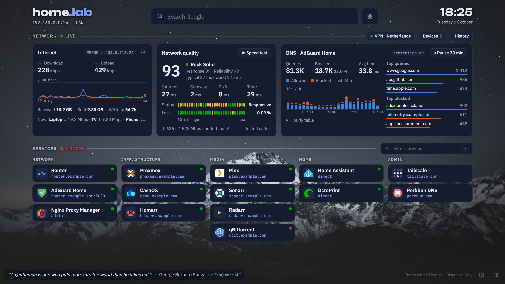
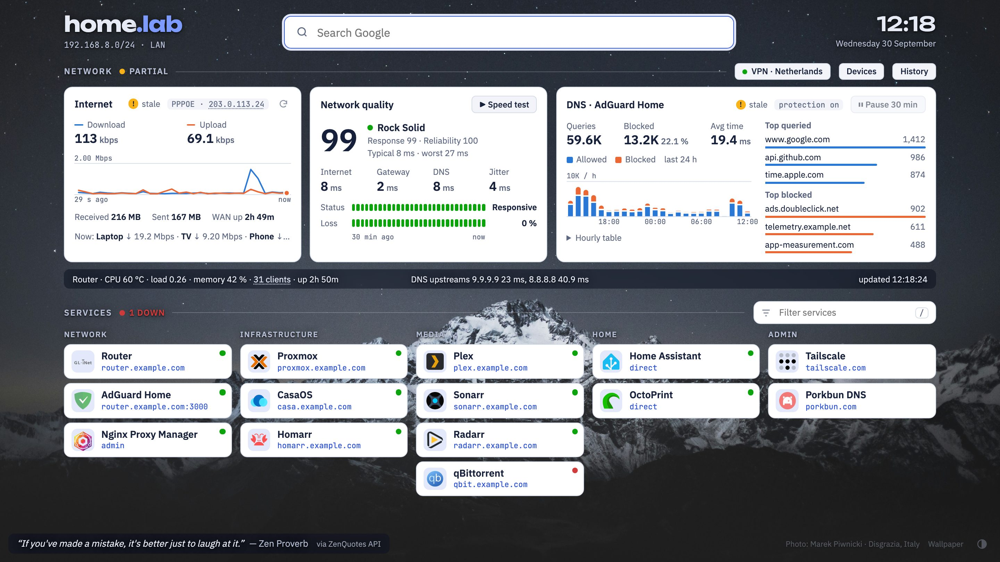

# glinet-dashboard

A self-hosted start page with live stats from a **GL.iNet** router: WAN traffic, the router's
**Network Quality** score, **AdGuard Home** DNS stats and a one-click / nightly **speed test**, next
to tiles for your homelab services. One small container, one port, configured with a single YAML file.



<details>
<summary>Light theme</summary>


</details>

## Features

- **Internet:** live download/upload rate with a 30-second chart, public IP and protocol, bytes received/sent and WAN uptime.
- **Network quality:** the same data as the GL.iNet *Network Quality* page:
  - score and level;
  - internet, gateway and DNS latency, jitter;
  - 30-minute status and packet-loss history.
- **Speed test:**
  - run the router's built-in speed test from the page, with live progress;
  - schedule it every night (for example at 03:00 router time);
  - the page shows when the last test ran.
- **DNS (AdGuard Home on the router):**
  - queries, blocked share and average processing time;
  - allowed/blocked per hour for the last 24 h;
  - top queried and top blocked domains.
- **Services:** grouped tiles with icons, instant filter (`/` to focus, Enter opens the first match), LAN address in the tooltip.
- **Start page extras:**
  - Google search box and clock;
  - quote of the day, downloaded daily and cached for offline use;
  - optional background image;
  - light/dark/auto theme with a switch.
- **Fits one screen** and scales up to fill large displays.
- **Live configuration:** edits to `services.yaml` show up within 30 seconds, without a restart or rebuild. Mistakes are reported on the page while the last valid version keeps working.

## Requirements

- A GL.iNet router with **firmware 4.x**. Developed on a GL-MT6000 (Flint 2); other 4.x models with the same features should work.
- Router features used, each optional; a card shows "stale" when its source is missing:

  | Feature | Needed for |
  |---|---|
  | **Network Quality** enabled | quality card, live rate, speed test |
  | **AdGuard Home** enabled on the router | DNS card |
  | **LuCI** reachable at `http://<router>:8080` (installed by default on GL.iNet 4.x) | WAN byte counters and uptime |

- The router `root` password.
- Docker on a machine in the same LAN (amd64 or arm64).

## Quick start

```sh
git clone https://github.com/sSpeaker/glinet-dashboard.git
cd glinet-dashboard
cp -r config.example config            # your own copy; it is git-ignored
# edit config/services.yaml: network.router, your services, title ...

export GL_PASS='your-router-root-password'   # or: echo "GL_PASS=..." > .env && chmod 600 .env
docker compose up -d
```

Open `http://<docker-host>:3100`.

**Without git:** download `docker-compose.yml` and pull the example config out of the image:

```sh
curl -O https://raw.githubusercontent.com/sSpeaker/glinet-dashboard/main/docker-compose.yml
docker run --rm --entrypoint tar sspeaker/glinet-dashboard -C /app -c config | tar x
```

**Plain `docker run`:**

```sh
docker run -d --name glinet-dashboard --restart unless-stopped -p 3100:3100 \
  -e GL_PASS='your-router-root-password' \
  -v "$PWD/config:/app/config:ro" -v glinet-dashboard-data:/app/data \
  sspeaker/glinet-dashboard:latest
```

The password is only ever read from the `GL_PASS` environment variable. Never put it in the YAML or the compose file.

### CasaOS

[`casaos/docker-compose.yml`](casaos/docker-compose.yml) installs the dashboard as a regular CasaOS app, with its own
tile, icon, running status, and start/stop/logs/settings in the CasaOS UI.

1. **Put a config into the app folder**, `/DATA/AppData/glinet-dashboard/config/` (the `services.yaml` plus `icons/` and the background). Use the CasaOS *Files* app, `scp`, or start from the example:

   ```sh
   sudo mkdir -p /DATA/AppData/glinet-dashboard
   sudo docker run --rm --entrypoint tar sspeaker/glinet-dashboard -C /app -c config \
     | sudo tar x -C /DATA/AppData/glinet-dashboard
   ```

2. **Import the app:** in CasaOS click **+** → **Install a customized app** → **Import** (top right). Paste the contents of [`casaos/docker-compose.yml`](casaos/docker-compose.yml) → **Submit**.
3. **Set the password:** fill in **GL_PASS** (router root password) → **Install**.

The tile opens `http://<casaos-host>:3100`. Edit `/DATA/AppData/glinet-dashboard/config/services.yaml` in place; changes
show up without a restart. The cache lives in `/DATA/AppData/glinet-dashboard/data`.

This variant runs as root inside the container, because CasaOS creates the AppData folders as root. It keeps the rest of the
hardening (read-only filesystem, all capabilities dropped), so it can only write to the data folder it owns.

## Configuration

Everything lives in `config/services.yaml`; images sit next to it. The example file is commented.

```yaml
page:
  tab_title: Home Lab            # browser tab
  title:                         # header; plain text or parts with colours
    - text: "home"
    - text: ".lab"
      color: accent              # accent (theme colour), "#e5534b", tomato, ...
  theme: auto                    # auto | light | dark (the on-page switch overrides it per browser)
  background:                    # optional
    image: background.jpg        # file in config/ or an https:// URL
    shade: 0.45                  # 0-0.9, veil in the theme colour
    blur: 0                      # 0-40 px
    tone: auto                   # auto | dark | light: brightness of the image, for readable text

network:
  subnet: 192.168.8.0/24         # shown under the title
  label: LAN
  router: 192.168.8.1            # the router the collector talks to (restart after changing)

speedtest:
  schedule: "03:00"              # daily automatic speed test, router local time; "" = off

groups:
  - name: Media
    services:
      - name: Plex
        url: https://plex.example.com      # opens in a new tab
        host: plex.example.com             # second line of the tile
        addr: 192.168.8.20:32400           # tooltip + searchable
        icon: plex.svg                     # file in config/icons/ or an https:// URL
        icon_dark: plex-light.svg          # optional variant for the dark theme
        mark: PL                           # letters shown when there is no icon
```

**Icons:** the example ships icons from [dashboard-icons](https://github.com/homarr-labs/dashboard-icons). Find more at
`https://cdn.jsdelivr.net/gh/homarr-labs/dashboard-icons/svg/<name>.svg` and save them into `config/icons/`.

### Environment variables

| Variable | Default | Meaning |
|---|---|---|
| `GL_PASS` | *(required)* | Router `root` password |
| `GL_USER` | `root` | Router user |
| `GL_HOST` | `network.router` from the config, else `192.168.8.1` | Router address override |
| `LUCI_PORT` | `8080` | LuCI port (WAN counters) |
| `ADGUARD_PORT` | `3000` | AdGuard Home port on the router |
| `WAN_INTERFACE` | `wan` | OpenWrt interface name of the WAN |
| `POLL_SECONDS` | `5` | Poll interval, 5-60 |
| `TOP_N` | `10` | Number of top domains kept |
| `PORT` | `3100` | HTTP port inside the container |

## How it works

A small Python collector (standard library plus `websocket-client` and `PyYAML`) logs in to the router
the same way the GL.iNet web UI does, polls it every few seconds and serves a cached JSON snapshot.
The page is a single static HTML file served by the same process.

| Card | Source |
|---|---|
| Network quality, live rate, speed test | GL web UI WebSocket `ws://<router>/ws`, topic `network_quality.status` (pushed every second) |
| WAN protocol and public IP | same WebSocket, topic `cable.status` |
| Router CPU, memory, clients | GL JSON-RPC `system.get_status` |
| WAN byte counters, uptime | LuCI ubus: `network.interface dump`, `luci-rpc getNetworkDevices` |
| DNS | AdGuard Home `:3000/control/stats` (AdGuard runs with `--glinet` and accepts the GL session cookie) |
| Quote of the day | [ZenQuotes](https://zenquotes.io/), [FavQs](https://favqs.com/) as backup; cached in `/app/data` |

Endpoints: `GET /api/status`, `GET /api/config`, `GET /api/quote`, `GET /assets/…` (images from the config folder),
`POST /api/speedtest` with `{"enable": true|false}`.

Notes:

- **HW NAT:** with hardware NAT (*netnat*) enabled, the router counts offloaded flows only partly, so rates and totals can be lower than real traffic. The GL UI shows the same caveat.
- **Counter resets:** WAN totals count since the WAN link came up and reset when PPPoE reconnects.
- **When the quote changes:** the providers switch at UTC midnight.

## Security

- **Router access:** all calls are read-only. The one exception is starting/stopping the speed test, which uses the same call as the GL UI button and changes no settings.
- **Safe to leave running:** failed logins back off exponentially (15 s up to 10 min), so a wrong password cannot trigger the router's brute-force lockout.
- **No authentication on the dashboard itself.** Keep it on your LAN or VPN, for example behind a reverse proxy with an internal-only DNS name, and do not expose it to the internet.
- **Speed test endpoint:** `POST /api/speedtest` only accepts `Content-Type: application/json`, which blocks cross-site form posts. Starts are limited to one per minute.
- **Container hardening:** read-only root filesystem, all capabilities dropped, runs as an unprivileged user. SVG assets are served with a CSP that blocks scripts.

## Development

```sh
docker build -t sspeaker/glinet-dashboard:latest .
GL_PASS='...' docker compose up -d
```

The page is plain HTML/CSS/JS in `index.html`; `collector.py` is the whole backend.

## Credits

- **Icons:** [homarr-labs/dashboard-icons](https://github.com/homarr-labs/dashboard-icons), Apache-2.0; logos are trademarks of their owners.
- **Background photo:** [Marek Piwnicki on Unsplash](https://unsplash.com/photos/ooxzy4JN6gw).
- **Quotes:** inspirational quotes provided by [ZenQuotes API](https://zenquotes.io/); backup source [FavQs](https://favqs.com/).
- **Not affiliated with GL.iNet.**

## License

[MIT](LICENSE)
